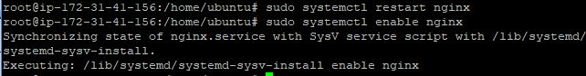
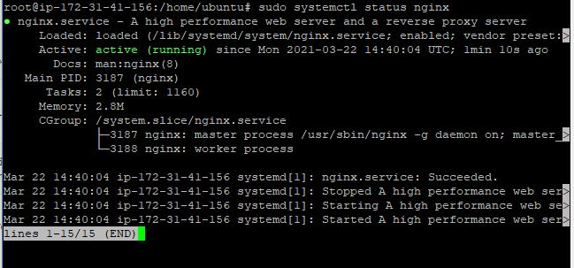
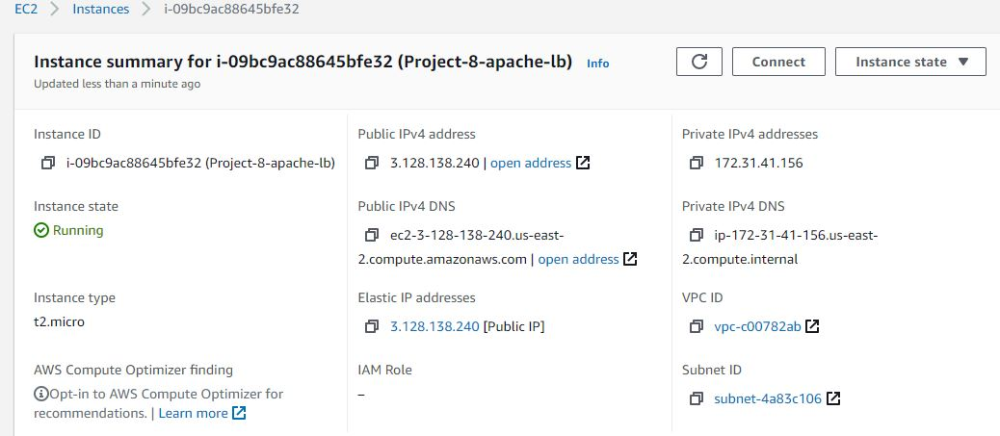
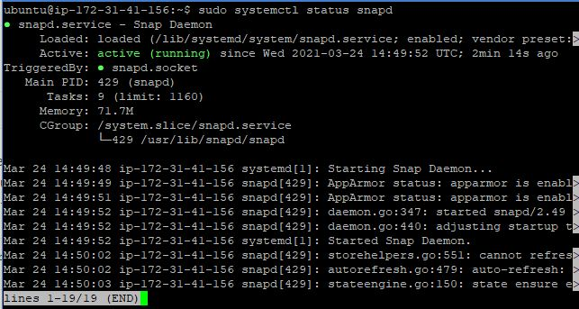
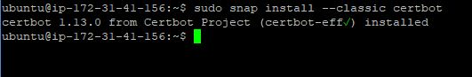
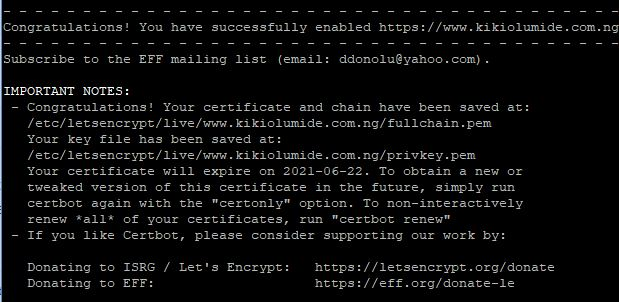
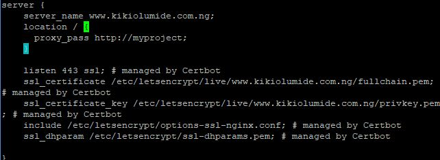
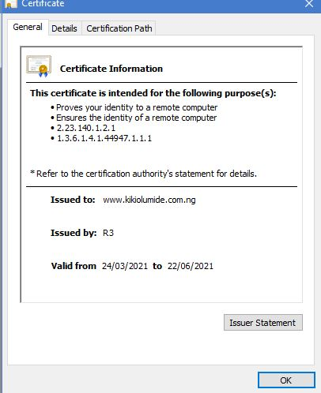
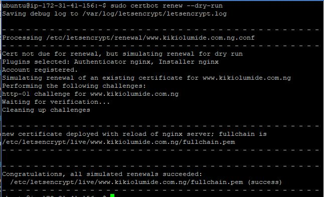

# Load Balancer Solution With Nginx and SSL/TLS
In this project I will configure an Nginx Load Balancer solution. It is also extremely important to ensure that connections to the Web solutions are secure and information is encrypted in transit - This will also cover connection over secured HTTP (HTTPS protocol), its purpose and what is required to implement it.

## Task
This project consists of two parts:

1. Configuration of Nginx as a Load Balancer
2. Register a new domain name and configure secured connection using SSL/TLS certificates

## Project Implementation
### Part 1 - Configuration of Nginx as a Load Balancer

  a. Create an EC2 VM based on Ubuntu Server 20.04 LTS and name it Nginx LB (do not forget to open TCP port 80 for HTTP connections, also open TCP port 443 - this port is used for secured HTTPS connections)
  
 b. Update /etc/hosts file for local DNS with Web Servers’ names (e.g. Web1 and Web2) and their local IP addresses
 
 c. Install and configure Nginx as a load balancer to point traffic to the resolvable DNS names of the web servers
 
   - Install Nginx
   
                sudo apt update

                sudo apt install nginx
     
     
     
   - Configure Nginx LB using Web Servers’ names defined in /etc/hosts
 
               sudo vi /etc/nginx/nginx.conf

                insert following configuration into http section

                 upstream myproject {
                    >server Web1 weight=5;
                    >server Web2 weight=5;
                  }

                server {
                    listen 80;
                    server_name www.domain.com;
                    location / {
                      proxy_pass http://myproject;
                    }
                  }

                #comment out this line
                #include /etc/nginx/sites-enabled/*;

  - Restart Nginx and make sure the service is up and running
 
                sudo systemctl restart nginx
                
                sudo systemctl enable nginx
                
                sudo systemctl status nginx

### Part 2 - Register a new domain name and configure secured connection using SSL/TLS certificates

a.  Register a new domain name with any registrar of your choice in any domain zone (e.g. .com, .net, .org, .edu, .info, .xyz or any other)

b.  Assign an Elastic IP to the Nginx LB server 

c.  Associate the domain name with this Elastic IP by Updating A record in your registrar to point to Nginx LB using Elastic IP address
 
d.  Configure Nginx to recognize your new domain name

- Update the nginx.conf with *server_name www.<your-domain-name.com>* instead of *server_name www.domain.com*

e. Install certbot and request for an SSL/TLS certificate

  - Make sure snapd service is active and running
  
         sudo systemctl status snapd
    
    
    
  - Install certbot
  
         sudo snap install --classic certbot

f. Request your certificate (just follow the certbot instructions - you will need to choose which domain you want your certificate to be issued for, domain name will be looked up from nginx.conf file so make sure it is updated)

        sudo ln -s /snap/bin/certbot /usr/bin/certbot
        sudo certbot --nginx
        

Test secured access to your Web Solution by trying to reach https://<your-domain-name.com>

You shall be able to access your website by using HTTPS protocol (that uses TCP port 443) and see a padlock pictogram in your browser’s search string. Click on the padlock icon and you can see the details of the certificate issued for your website.

g. Set up periodical renewal of your SSL/TLS certificate

*By default, LetsEncrypt certificate is valid for 90 days, so it is recommended to renew it at least every 60 days or more frequently.*

 - Test the renewal command in dry-run mode

        sudo certbot renew --dry-run

Best practice is to have a scheduled job that to run renew command periodically. Configure a cronjob to run the command twice a day.

 - Edit the crontab file with the following command:

        crontab -e
	
        Add following line:

        * */12 * * *   root /usr/bin/certbot renew > /dev/null 2>&1

## BLOCKERS

None

## RESOURCES

1. https://docs.aws.amazon.com/AWSEC2/latest/UserGuide/elastic-ip-addresses-eip.html#using-instance-addressing-eips-allocating
2. https://dev.to/maybebored/how-to-set-up-a-custom-domain-for-your-ec2-instance-without-using-route53-f9
3. https://crontab.guru/
4. https://youtu.be/4g1i0ylvx3A
5. https://darey.io
